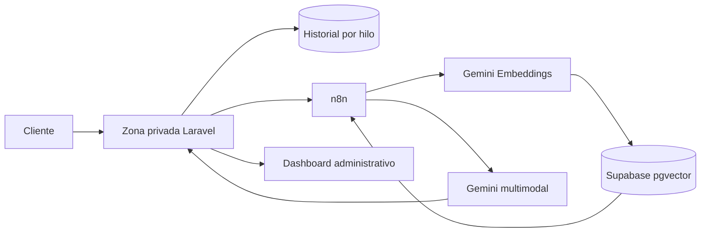

# AIQ · Plataforma digital y Asesor IA

Plataforma web de AIQ para publicar su catálogo técnico, administrar contenidos y ofrecer a sus clientes un espacio privado con asistencia inteligente especializada en procesos plásticos.

El sistema reúne el sitio institucional, un panel de administración, la zona privada de clientes y un asistente con memoria por conversación, análisis de imágenes y recuperación de conocimiento técnico.

## Funcionalidades principales

### Sitio público

- Presentación institucional y canales de contacto.
- Catálogo de masterbatches, bobinas, láminas y termoformados.
- Categorías, subcategorías, productos, novedades y paletas de colores.
- Formularios comerciales, presupuestos y suscripción al newsletter.
- Contenido administrable sin modificar el código.

### Zona privada de clientes

- Registro, acceso y recuperación de cuenta.
- Habilitación, suspensión y límites de uso administrados por AIQ.
- Panel personal con actividad, conversaciones recientes y consumo del asistente.
- Hilos persistentes: cada conversación conserva su propio contexto.
- Adjuntos de imagen para analizar piezas, films, bolsas, superficies y defectos de proceso.
- Eliminación privada de chats: el cliente deja de verlos, pero la trazabilidad administrativa permanece mientras corresponda conservarla.

### Asesor AIQ

- Respuestas técnicas y comerciales en español, adaptadas al contexto del cliente.
- Memoria aislada por cliente y por hilo para continuar casos sin repetir el relevamiento.
- RAG sobre documentación interna: recupera fragmentos relevantes antes de responder.
- Interpretación visual para orientar diagnósticos de extrusión, soplado, inyección y termoformado.
- Lectura de texto o códigos visibles en imágenes cuando su calidad lo permite.
- Recomendaciones respaldadas por la base técnica, sin inventar productos, códigos ni dosificaciones.
- Derivación a WhatsApp con un resumen útil del caso para el equipo comercial.
- Uso del contenido técnico sin entregar los archivos fuente ni enlaces de descarga al cliente.

### Administración

- Gestión del sitio, catálogo, clientes y permisos de acceso.
- Configuración segura de integraciones e instrucciones del asistente.
- Carga e indexación asíncrona de documentos PDF.
- Dashboard de uso de IA con métricas, tendencias, clientes activos e historial completo de hilos.
- Auditoría de conversaciones incluso cuando fueron ocultadas desde la interfaz del cliente.
- Limpieza programada de cuentas y conversaciones inactivas según la política configurada.

## Arquitectura de IA



El backend identifica cada caso por cliente y conversación, envía a la automatización la consulta actual junto con su memoria y recupera conocimiento mediante embeddings de 768 dimensiones. Las imágenes se incorporan al contexto multimodal; los documentos originales y los secretos de integración permanecen fuera del repositorio.

## Tecnologías

- PHP 8.2 y Laravel 12.
- MySQL/MariaDB para la aplicación.
- Vue 3, Inertia.js, Tailwind CSS y Vite.
- n8n para orquestación de flujos de IA.
- Google Gemini para generación, visión y embeddings.
- Supabase/PostgreSQL con `pgvector` para búsqueda semántica.
- Laravel Scheduler para tareas de mantenimiento.

## Requisitos

- PHP 8.2 o superior y Composer 2.
- Node.js 18 o superior y npm.
- MySQL 8 o MariaDB compatible.
- Extensiones PHP requeridas por Laravel, además de las utilizadas por Excel y códigos QR.
- Una integración n8n/Gemini configurada para habilitar las funciones de IA.

## Instalación local

```bash
git clone https://github.com/santiagoAbasto/AIQ.git
cd AIQ

composer install
npm install

cp .env.example .env
php artisan key:generate
```

Configurá la base de datos y las integraciones en `.env`, y luego ejecutá:

```bash
php artisan migrate
php artisan storage:link
npm run build
php artisan serve
```

Si necesitás crear el administrador inicial mediante seeders, definí `AIQ_ADMIN_EMAIL` y una contraseña robusta en `AIQ_ADMIN_PASSWORD`, y ejecutá `php artisan db:seed`. Sin ambas variables, el seeder omite deliberadamente esa cuenta.

Para desarrollo frontend con recarga automática:

```bash
npm run dev
```

## Configuración de IA

Las credenciales pueden definirse en el panel administrativo o mediante las variables disponibles en `.env.example`:

- `N8N_API_KEY`
- `N8N_TECHNICAL_WEBHOOK_URL`
- `N8N_COMMERCIAL_WEBHOOK_URL`
- `N8N_KNOWLEDGE_WEBHOOK_URL`
- `GEMINI_API_KEY`
- `GEMINI_MODEL`

Nunca publiques valores reales, exportaciones de workflows con credenciales, documentos de conocimiento ni archivos enviados por clientes.

## Tareas programadas

El proyecto incluye una limpieza diaria de datos inactivos:

```bash
php artisan clientes:purge-inactive-data --days=30 --dry-run
php artisan clientes:purge-inactive-data --days=30
```

En producción, Laravel Scheduler debe ejecutarse cada minuto:

```cron
* * * * * cd /ruta/al/proyecto && php artisan schedule:run >> /dev/null 2>&1
```

La tarea definitiva corre diariamente a las 03:20 y evita ejecuciones superpuestas.

## Calidad y verificación

```bash
php artisan test
./vendor/bin/pint --test
npm run build
```

Antes de desplegar cambios de configuración o rutas:

```bash
php artisan optimize:clear
php artisan route:cache
php artisan view:cache
```

## Datos y seguridad

- `.env`, claves, respaldos, logs, bases locales y credenciales están excluidos de Git.
- Las imágenes, PDFs y demás archivos operativos de `storage` no forman parte del repositorio.
- Cada instalación debe generar su propia `APP_KEY`.
- Los callbacks de n8n deben autenticarse y utilizar HTTPS en producción.
- La base de conocimiento puede orientar respuestas, pero no debe exponer sus documentos fuente.
- La retención y eliminación de datos debe ajustarse a la política y normativa aplicable a cada despliegue.

## Estructura

```text
app/                 Dominio, modelos, controladores y tareas
config/              Configuración de Laravel e integraciones
database/            Migraciones, factories y seeders
resources/views/     Sitio público, administración y zona privada
resources/js/        Aplicación Vue/Inertia
routes/               Rutas web, API y scheduler
tests/                Pruebas automatizadas
```

## Propiedad

Proyecto desarrollado para AIQ. El código se publica con todos los derechos reservados; su disponibilidad en GitHub no concede permiso de uso, copia, modificación o redistribución salvo autorización expresa de sus titulares.
